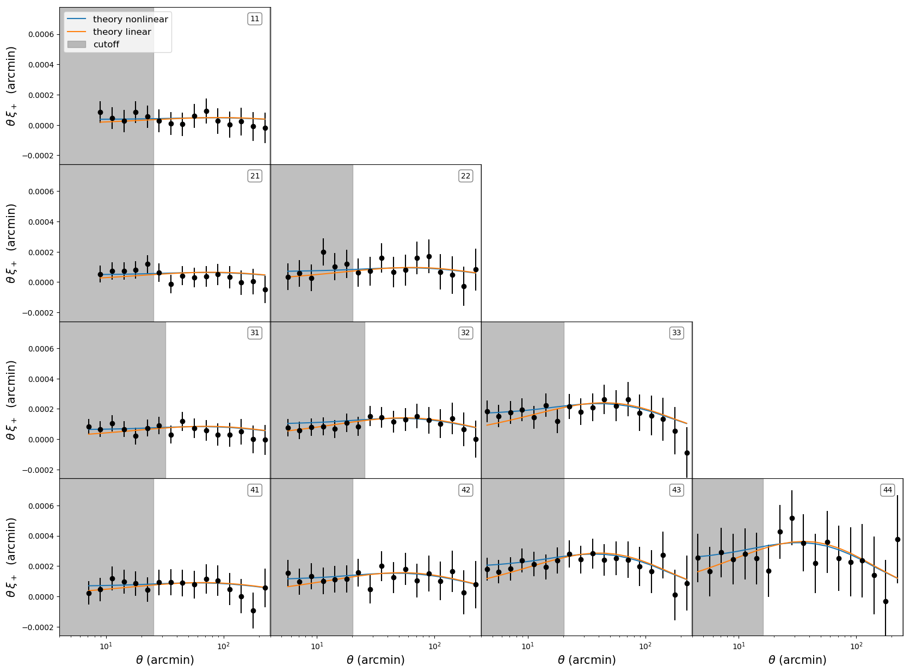
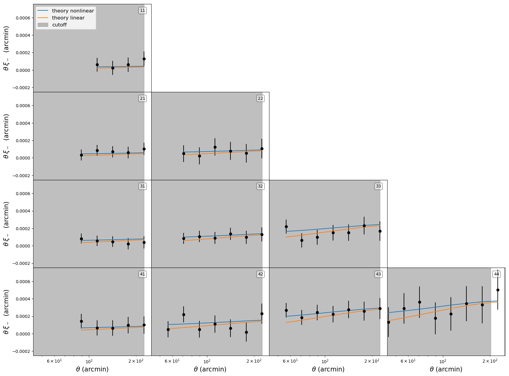
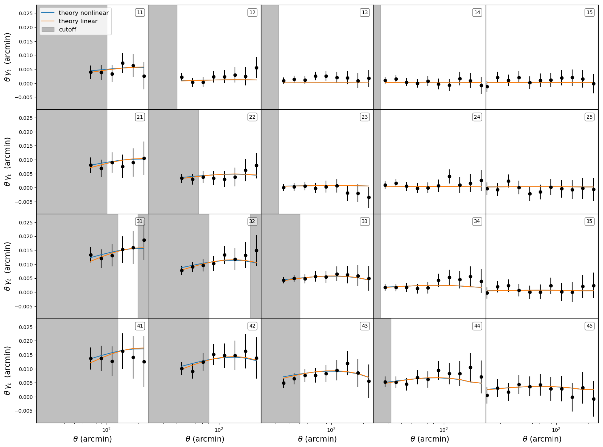
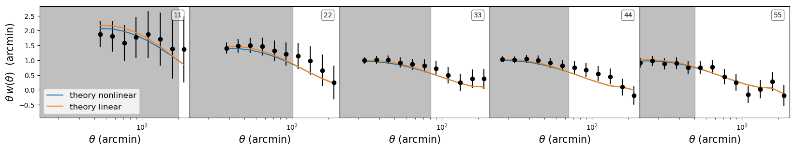
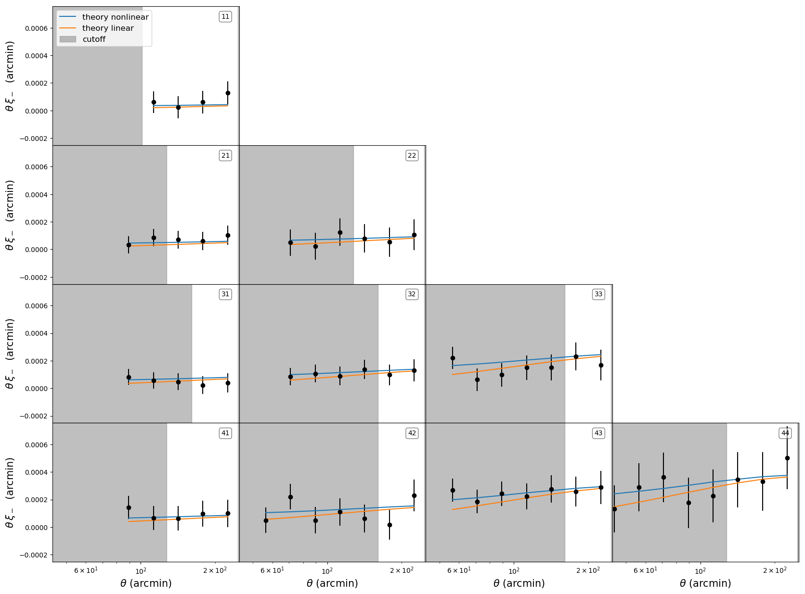
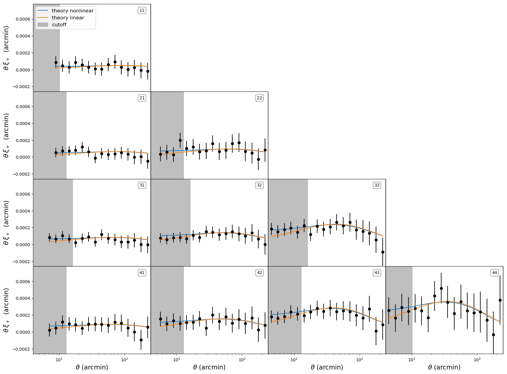
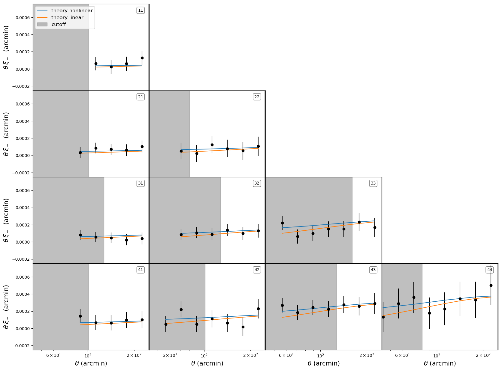
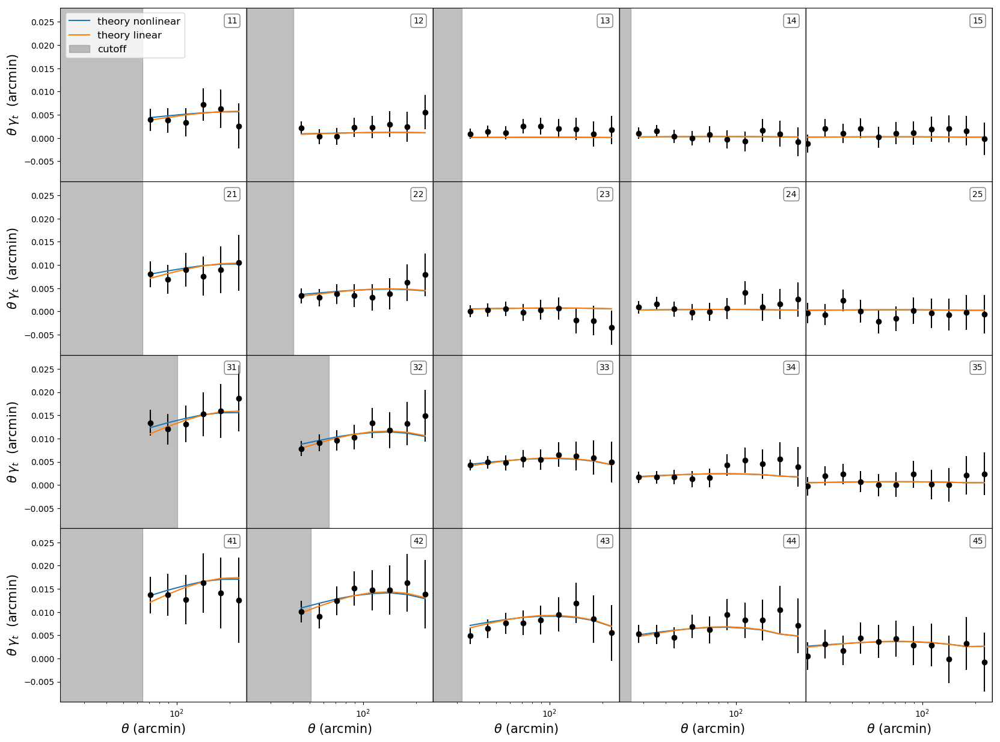
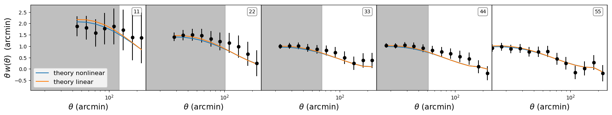

MGCosmoMC 
===========
## Modified Growth with CosmoMC
This is the official repository for the MGCosmoMC package. It implements the patch [MGCAMB](https://github.com/sfu-cosmo/MGCAMB) into the popular Markov Chain Monte Carlo engine [CosmoMC](https://github.com/cmbant/CosmoMC). This version is upgraded to be compatible with the latest CosmoMC(v1.3.2).

## Table of contents
* [1. Introduction](#1-introduction)
    * [Citing MGCosmoMC](#citing-mgcosmomc)
* [2. How to install](#2-how-to-install)
* [3. How to run](#3-how-to-run)
* [4. Installing Planck 2018 ](#4-installing-planck-2018)
* [5. DES 1YR dataset](#5-des-1yr-dataset)
    * [Aggressive cut](#aggressive-cut)
    * [Standard cut](#standard-cut)
    * [Soft cut](#soft-cut)
* [7. Authors List](#authors-list)


## 1. Introduction
MGCosmoMC allows to set constraint on Modified Growth (MG) - Dark Energy (DE) scenarios using cosmological data. It is a patch for the popular code [CosmoMC](https://github.com/cmbant/CosmoMC), and as such it follows all the installing procedures and running procedures. We refer the reader to the [official CosmoMC webpage](http://cosmologist.info/cosmomc/) and the [ReadMe](http://cosmologist.info/cosmomc/readme.html) for the instructions.

### Citing MGCosmoMC
If you use MGCosmoMC for your scientific work, please cite the following papers:

* *New MGCAMB tests of gravity with CosmoMC and Cobaya*\
    Zhuangfei Wang, Seyed Hamidreza Mirpoorian, Levon Pogosian, Alessandra Silvestri, Gong-Bo Zhao\
    [arXiv:2305.05667 [astro-ph.CO]](https://arxiv.org/abs/2305.05667)

    
* *MGCAMB with massive neutrinos and dynamical dark energy*   
    Alex Zucca, Levon Pogosian, Alessandra Silvestri, and Gong-Bo Zhao  
    [arXiv:1901.05956 [astro-ph.CO]](https://arxiv.org/abs/1901.05956)


* *Testing Gravity with CAMB and CosmoMC*  
Alireza Hojjati, Levon Pogosian, Gong-Bo Zhao,  
[arXiv:1106.4543 [astro-ph.CO]](https://arxiv.org/abs/1106.4543), [JCAP 1108:005,2011](http://iopscience.iop.org/article/10.1088/1475-7516/2011/08/005)


* *Searching for modified growth patterns with tomographic surveys*  
Gong-Bo Zhao, Levon Pogosian, Alessandra Silvestri, Joel Zylberberg,  
[arXiv:0809.3791 [astro-ph]](http://arxiv.org/abs/0809.3791), [Phys. Rev. D 79, 083513](https://journals.aps.org/prd/abstract/10.1103/PhysRevD.79.083513)


as well as the original CAMB [paper](http://arxiv.org/abs/astro-ph/9911177)  and CosmoMC [paper](https://arxiv.org/abs/astro-ph/0205436). 

## 2. How to install
To install MGCosmoMC simply run on your terminal:
```bash
git clone https://github.com/sfu-cosmo/MGCosmoMC
cd MGCosmoMC
make cosmomc
```
Follow these [instructions](http://cosmologist.info/cosmomc/readme.html) for a step-by-step guide to install CosmoMC.

As a general rule, if you are able to install CosmoMC, then you will be able to install MGCosmoMC.

## 3. How to run
Before running MGCosmoMC set your model parameters in [```params_CMB_MG.ini```](batch3/params_CMB_MG.ini). Pick a ``` MG_flag ``` to choose which model you are going to analyze. For a structure of the models see the [MGCAMB page](https://github.com/sfu-cosmo/MGCAMB).

```GRtrans ```  set the scale factor at which MG is switched on. We suggest to set it larger or equal than 0.001. 

Since in the MG formalism there is no prescription to build a non-linear P(k), we suggest to set the flag ``` use_nonlinear = F ```. To do so, some data requires a proper cut to eliminate the nonlinear scales. The cuts on DES 1YR dataset is described in Sec. [5](#5-des-1yr-dataset)


## 4. Installing Planck 2018
MGCosmoMC could work with Planck 2018 likelihood, which needs to be installed separately in advance. Please use the Planck 2018 likelihood with MGCosmoMC by following the procedure illustrated in this Section.

In the following, ```/$$$``` is meant to be replaced by the path specific to your installation.
 
1. Add these lines to your ```.bashrc``` (but with your customized paths instead of` ```/$$$```):

```bash
export PYTHONPATH=/$$$/MGCosmoMC/python:$PYTHONPATH
export PLC_PATH=/$$$/Planck2018/baseline/plc_3.0/
source /$$$/Planck2018/plc_3.0/plc-3.01/bin/clik_profile.sh
```

and run

```bash
source /.bashrc
```


2. Create a symbolic link to the Planck likelihoods:

```bash
ln -s $PLC_PATH MGCosmoMC/data/clik_14.0
```

3. Now change into the MGCosmoMC directory and run ```make```
```bash
cd MGCosmoMC
make
```

4. Now try running the standard CosmoMC test using the ```test_planck.ini``` file:

```
./cosmomc test_planck.ini
```
This will print some stuff on the screen, testing all the Planck likelihoods and any other likelihoods specified in the ```test_planck.ini``` and ```test.ini``` files. Then it will likely stop with some error message, e.g. 

```bash
Test likelihoods done, total logLike, chi-eq =    2103.781   4207.563
Expected likelihoods,  total logLike, chi-eq =    2625.485   5250.970
 ** Likelihoods do not match **
```
In any case, as long as it can run the Planck 2018 likelihoods, you are OK and all other procedures are the same as you would do before the update.


## 5. DES 1YR dataset

Since there is no MG counterpart of Halofit, nonlinear corrections should be turned off when using MGCosmoMC. Datasets probing nonlinear scales should be used with care and with proper cuts (to avoid nonlinear scales). For the DES 1YR dataset we provide three cuts of the nonlinear regime: soft, standard and aggressive. Choose one of them in [DES_1YR_final.dataset](data/DES/DES_1YR_final.dataset) . Also, be sure to set ```wl_use_nonlinear = F``` and ```wl_use_Weyl = T```  in [DES.ini](batch3/DES.ini).  

The weak lensing likelihood is modified to use the Weyl potential: the new implementation is in [wl.f90](source/wl.f90), while the default code is kept in [wl_std.f90](source/wl_std.f90)

The method to cut the data is described in our paper and it is based on this [DES paper](https://arxiv.org/abs/1810.02499). 

The code used to generate this cuts can be found in this [repository](https://github.com/alexzucca90/DES_linear_data)

### Aggressive Cut
The aggressive cut is obtained by setting Delta Chi^2 = 1 . The shaded regions in the plots below are removed:

<p align="center">


</p>

<p align="center">


</p>


### Standard Cut
The starndard cut is obtained by setting Delta Chi^2 = 5 . The shaded regions in the plots below are removed:

<p align="center">


</p>
<p align="center">


</p>


### Soft Cut
The soft cut is obtained by setting Delta Chi^2 = 10. The shaded regions in the plots below are removed:

<p align="center">


</p>
<p align="center">


</p>


## 7. Authors List
Main Developers:
- [Zhuangfei Wang] Email: zhuangfei_wang@sfu.ca
- [Alex Zucca] Email: alexzucca90@gmail.com

Original Code Developers:
* [Gong-Bo Zhao](http://icosmology.info)
* Alireza Hojjati
* [Levon Pogosian](http://www.sfu.ca/%7Elevon/)
* [Alessandra Silvestri](http://wwwhome.lorentz.leidenuniv.nl/%7Esilvestri/Home.html)


Repo created and maintained by Zhuangfei Wang. If you find any bugs in the code, please contact Zhuangfei Wang at zhuangfei_wang@sfu.ca .

<p align="center">
    <a href="http://www.sfu.ca/physics.html"></a>
    <a href="http://www.sfu.ca/physics/cosmology/"></a>
</p>
